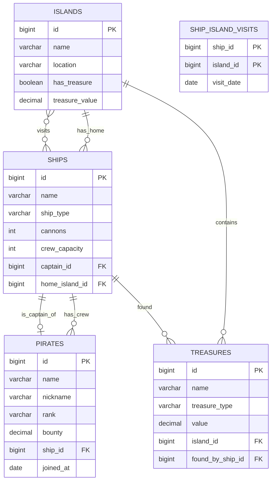

# 🗺️ Diagram Bazy Danych Piratów

## Entity Relationship Diagram (ERD)



## Diagram tekstowy (ASCII)

```
┌─────────────────────────────────────────────────────────────────────────────────────┐
│                           SCHEMAT BAZY DANYCH PIRATÓW                               │
└─────────────────────────────────────────────────────────────────────────────────────┘

┌─────────────────────┐          ┌─────────────────────┐          ┌─────────────────────┐
│      ISLANDS        │          │       SHIPS         │          │      PIRATES        │
├─────────────────────┤          ├─────────────────────┤          ├─────────────────────┤
│ 🔑 id (PK)          │◄─────────│ 🔗 home_island_id   │          │ 🔑 id (PK)          │
│    name             │          │ 🔑 id (PK)          │◄─────────│ 🔗 ship_id          │
│    location         │          │    name             │          │    name             │
│    has_treasure     │          │    ship_type        │ ────────►│    nickname         │
│    treasure_value   │          │    cannons          │captain_id│    rank             │
└─────────────────────┘          │    crew_capacity    │          │    bounty           │
         ▲                       │ 🔗 captain_id       │          │    joined_at        │
         │                       └─────────────────────┘          └─────────────────────┘
         │                                 │
         │                                 │
         │                                 ▼
┌─────────────────────┐          ┌─────────────────────┐
│     TREASURES       │          │  SHIP_ISLAND_VISITS │
├─────────────────────┤          ├─────────────────────┤
│ 🔑 id (PK)          │          │ 🔑🔗 ship_id (PK,FK)│
│    name             │          │ 🔑🔗 island_id(PK,FK│
│    treasure_type    │          │     visit_date      │
│    value            │          └─────────────────────┘
│ 🔗 island_id ───────┼───────────────────▲
│ 🔗 found_by_ship_id │                   │
└─────────────────────┘                   │
```

## Opis tabel

### 🏝️ ISLANDS (Wyspy)
Przechowuje informacje o wyspach w świecie piratów.

| Kolumna | Typ | Opis |
|---------|-----|------|
| `id` | BIGINT | Klucz główny, auto-increment |
| `name` | VARCHAR(100) | Nazwa wyspy (NOT NULL) |
| `location` | VARCHAR(200) | Lokalizacja geograficzna |
| `has_treasure` | BOOLEAN | Czy wyspa ma skarb (domyślnie FALSE) |
| `treasure_value` | DECIMAL(15,2) | Wartość skarbu na wyspie |

### ⛵ SHIPS (Statki)
Przechowuje informacje o statkach pirackich.

| Kolumna | Typ | Opis |
|---------|-----|------|
| `id` | BIGINT | Klucz główny, auto-increment |
| `name` | VARCHAR(100) | Nazwa statku (NOT NULL) |
| `ship_type` | VARCHAR(50) | Typ statku (Galleon, Frigate, Sloop) |
| `cannons` | INT | Liczba armat (domyślnie 0) |
| `crew_capacity` | INT | Maksymalna pojemność załogi (domyślnie 50) |
| `captain_id` | BIGINT | FK → pirates.id (kapitan) |
| `home_island_id` | BIGINT | FK → islands.id (macierzysta wyspa) |

### 🏴‍☠️ PIRATES (Piraci)
Przechowuje informacje o piratach.

| Kolumna | Typ | Opis |
|---------|-----|------|
| `id` | BIGINT | Klucz główny, auto-increment |
| `name` | VARCHAR(100) | Imię i nazwisko pirata (NOT NULL) |
| `nickname` | VARCHAR(100) | Pseudonim |
| `rank` | VARCHAR(50) | Ranga (Captain, First Mate, Quartermaster, etc.) |
| `bounty` | DECIMAL(15,2) | Nagroda za głowę (domyślnie 0) |
| `ship_id` | BIGINT | FK → ships.id (statek) |
| `joined_at` | DATE | Data dołączenia do załogi |

### 💎 TREASURES (Skarby)
Przechowuje informacje o skarbach.

| Kolumna | Typ | Opis |
|---------|-----|------|
| `id` | BIGINT | Klucz główny, auto-increment |
| `name` | VARCHAR(100) | Nazwa skarbu (NOT NULL) |
| `treasure_type` | VARCHAR(50) | Typ skarbu (Gold, Artifacts, etc.) |
| `value` | DECIMAL(15,2) | Wartość skarbu (NOT NULL) |
| `island_id` | BIGINT | FK → islands.id (lokalizacja) |
| `found_by_ship_id` | BIGINT | FK → ships.id (kto znalazł) |

### 🗓️ SHIP_ISLAND_VISITS (Wizyty statków na wyspach)
Tabela łącząca - relacja many-to-many między statkami a wyspami.

| Kolumna | Typ | Opis |
|---------|-----|------|
| `ship_id` | BIGINT | PK, FK → ships.id |
| `island_id` | BIGINT | PK, FK → islands.id |
| `visit_date` | DATE | Data wizyty |

## Typy relacji

| Relacja | Kardynalność | Opis |
|---------|--------------|------|
| `ISLANDS ← SHIPS` | 1:N | Jedna wyspa może być domem dla wielu statków |
| `SHIPS ← PIRATES` | 1:N | Jeden statek może mieć wielu piratów |
| `PIRATES → SHIPS` | 1:1 | Jeden pirat jest kapitanem jednego statku |
| `ISLANDS ← TREASURES` | 1:N | Na jednej wyspie może być wiele skarbów |
| `SHIPS ← TREASURES` | 1:N | Jeden statek może znaleźć wiele skarbów |
| `SHIPS ↔ ISLANDS` | M:N | Wiele statków odwiedza wiele wysp (przez SHIP_ISLAND_VISITS) |

---

## Przykładowe zapytania sprawdzające strukturę (H2)

```sql
-- Sprawdź strukturę tabeli
SHOW COLUMNS FROM pirates;

-- Wyświetl wszystkie tabele
SHOW TABLES;

-- Wyświetl wszystkie klucze obce
SELECT 
    TC.TABLE_NAME,
    TC.CONSTRAINT_NAME,
    TC.CONSTRAINT_TYPE
FROM INFORMATION_SCHEMA.TABLE_CONSTRAINTS TC
WHERE TC.CONSTRAINT_TYPE = 'FOREIGN KEY';

-- Szczegóły kluczy obcych (które kolumny referencjonują które)
SELECT 
    CU.CONSTRAINT_NAME,
    CU.TABLE_NAME AS SOURCE_TABLE,
    CU.COLUMN_NAME AS SOURCE_COLUMN,
    CU2.TABLE_NAME AS TARGET_TABLE,
    CU2.COLUMN_NAME AS TARGET_COLUMN
FROM INFORMATION_SCHEMA.REFERENTIAL_CONSTRAINTS FK
JOIN INFORMATION_SCHEMA.KEY_COLUMN_USAGE CU 
    ON FK.CONSTRAINT_NAME = CU.CONSTRAINT_NAME
JOIN INFORMATION_SCHEMA.KEY_COLUMN_USAGE CU2 
    ON FK.UNIQUE_CONSTRAINT_NAME = CU2.CONSTRAINT_NAME;

-- Wyświetl wszystkie kolumny tabeli pirates
SELECT 
    COLUMN_NAME, 
    DATA_TYPE, 
    IS_NULLABLE, 
    COLUMN_DEFAULT
FROM INFORMATION_SCHEMA.COLUMNS 
WHERE TABLE_NAME = 'PIRATES';
```
