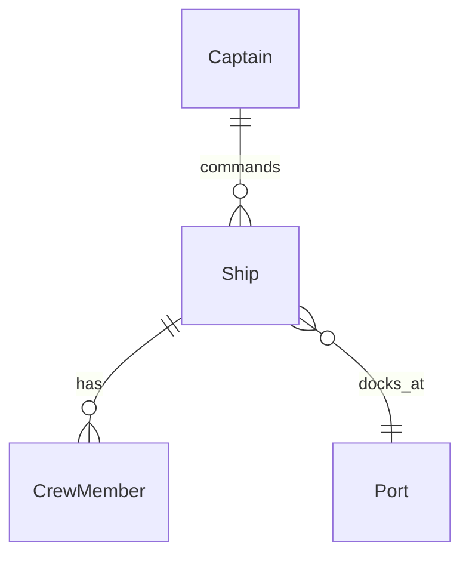

# Moduł 04: Tools & AI Coaching

## 🎯 Cel modułu
Narzędzia wspierające jakość kodu i wykorzystanie AI w pracy Junior Developera.

> **Kontekst:** Ten moduł jest szczególnie ważny dla juniorów - narzędzia AI mogą znacząco przyspieszyć naukę i rozwiązywanie problemów!

---

## 📁 Struktura modułu

```
m04-tools-and-ai/
├── src/main/java/pl/przemekzagorski/training/tools/
│   ├── CodeWithIssues.java      # Kod z celowymi błędami
│   ├── AICoachingPrompts.java   # Prompty AI dla juniorów
│   └── ToolsExercises.java      # Ćwiczenia praktyczne
└── README.md
```

---

## 📚 Zawartość

| Plik | Opis |
|------|------|
| `CodeWithIssues.java` | Kod z celowymi błędami - do analizy SonarLint |
| `AICoachingPrompts.java` | Kolekcja promptów AI dla 6 scenariuszy |
| `ToolsExercises.java` | 6 ćwiczeń praktycznych |

---

## 🔍 SonarLint (wtyczka IDE)

### Instalacja

**IntelliJ IDEA:**
1. `File` → `Settings` → `Plugins`
2. Wyszukaj "SonarLint"
3. `Install` → `Restart IDE`

**VS Code:**
1. Extensions (`Ctrl+Shift+X`)
2. Wyszukaj "SonarLint"
3. Install

### Co wykrywa SonarLint?

| Kategoria | Przykład | Priorytet |
|-----------|----------|-----------|
| 🐛 Bug | Null pointer, resource leak | Krytyczny |
| 🔓 Vulnerability | SQL injection, hardcoded password | Wysoki |
| 🦨 Code Smell | Unused variable, complex method | Średni |

### Praktyka

Otwórz `CodeWithIssues.java` - SonarLint podświetli problemy!

```java
// Przykłady problemów które wykryje:
String password = "admin123";           // Vulnerability!
if (ship = null) { ... }                // Bug (= zamiast ==)
public int count = 0;                   // Code smell (public field)
```

---

## 🤖 AI Coaching dla Juniorów

### Gdzie AI może Ci pomóc?

| Scenariusz | Kiedy użyć | Przykładowy prompt |
|------------|------------|-------------------|
| **Onboarding** | Nowy projekt | "Przeanalizuj strukturę i wyjaśnij architekturę" |
| **Zrozumienie kodu** | Skomplikowany kod | "Wyjaśnij co robi ta metoda linia po linii" |
| **Debugowanie** | Błąd w runtime | "Dlaczego dostaję LazyInitializationException?" |
| **Dokumentacja** | Brak JavaDoc | "Napisz JavaDoc dla tej klasy" |
| **Diagramy** | Wizualizacja | "Wygeneruj diagram ERD w Mermaid" |
| **Code Review** | Przed PR | "Sprawdź ten kod pod kątem SOLID" |

---

### 📝 Szczegółowe prompty

#### 1. Onboarding w nowy projekt

```
Jestem nowym developerem w tym projekcie. Przeanalizuj strukturę 
i wyjaśnij:
1. Jaka jest architektura projektu?
2. Jakie warstwy widzisz (controllers, services, repositories)?
3. Jakie są główne encje domenowe?
4. Od czego powinienem zacząć eksplorację?
```

#### 2. Zrozumienie kodu

```
Wyjaśnij krok po kroku co robi ta metoda:
- Jakie są parametry wejściowe?
- Co zwraca?
- Jakie są potencjalne edge cases?
- Czy są jakieś problemy z tym kodem?

[wklej kod]
```

#### 3. Debugowanie

```
Dostaję błąd [wklej stack trace].

1. Co oznacza ten błąd?
2. Jakie są typowe przyczyny?
3. Jak mogę go naprawić?
4. Jak zapobiec temu w przyszłości?
```

#### 4. Generowanie dokumentacji

```
Napisz JavaDoc dla tej klasy:
- Opis co robi klasa
- @param dla każdego parametru
- @return co zwraca
- @throws jakie wyjątki rzuca
- Przykład użycia

[wklej kod]
```

#### 5. Generowanie diagramów

```
Na podstawie tych encji JPA wygeneruj:
1. Diagram ERD w formacie Mermaid
2. Pokaż relacje między encjami
3. Oznacz typy relacji (1:N, M:N)

[wklej encje]
```

**Przykład wyniku (Mermaid):**


#### 6. Code Review

```
Sprawdź ten kod pod kątem:
1. Zasad SOLID
2. Code smells
3. Potencjalnych bugów
4. Best practices Java 21

Zasugeruj ulepszenia z przykładami kodu.

[wklej kod]
```

---

### ⚠️ Zasady bezpieczeństwa AI

| ❌ NIE RÓB | ✅ RÓB TAK |
|------------|-----------|
| Nie wklejaj haseł | Zamień na `"***"` |
| Nie wklejaj kluczy API | Użyj `"API_KEY_PLACEHOLDER"` |
| Nie wklejaj danych klientów | Anonimizuj dane |
| Nie ufaj ślepo odpowiedziom | Weryfikuj przed użyciem |

---

## 🔄 CI/CD Podstawy

### Co to jest CI/CD?

**CI (Continuous Integration):** Automatyczne budowanie i testowanie przy każdym pushu.
**CD (Continuous Deployment):** Automatyczne wdrażanie na serwer.

```
┌─────────┐    ┌─────────┐    ┌─────────┐    ┌─────────┐
│  Push   │───▶│  Build  │───▶│  Test   │───▶│ Deploy  │
└─────────┘    └─────────┘    └─────────┘    └─────────┘
     │              │              │              │
     └──────────────┴──────────────┴──────────────┘
                    Automatycznie!
```

### GitHub Actions - prosty przykład

Plik `.github/workflows/ci.yml`:

```yaml
name: Java CI

on: [push, pull_request]

jobs:
  build:
    runs-on: ubuntu-latest
    
    steps:
    - uses: actions/checkout@v4
    
    - name: Set up JDK 21
      uses: actions/setup-java@v4
      with:
        java-version: '21'
        distribution: 'temurin'
    
    - name: Build with Maven
      run: mvn clean verify
```

### Co daje CI/CD?

| Korzyść | Opis |
|---------|------|
| 🔄 Automatyzacja | Build + test przy każdym push |
| 🐛 Szybkie wykrywanie | Błędy widać od razu |
| ✅ Pewność | Kod działa przed merge |
| 📊 Raport | Historia buildów |

---

## 📝 Ćwiczenia (25 min)

Otwórz `ToolsExercises.java`:

| # | Ćwiczenie | Czas | Narzędzie |
|---|-----------|------|-----------|
| 1 | SonarLint - znajdź i napraw problemy | 5 min | SonarLint |
| 2 | AI Onboarding - zrozum moduł m06 | 5 min | GitHub Copilot |
| 3 | AI Dokumentacja - wygeneruj JavaDoc | 3 min | GitHub Copilot |
| 4 | AI Debugowanie - rozwiąż błąd | 5 min | GitHub Copilot |
| 5 | AI Diagramy - wygeneruj ERD | 4 min | GitHub Copilot |
| 6 | CI/CD - przeanalizuj workflow | 3 min | GitHub |

---

## 🎯 Podsumowanie: Kiedy używać którego narzędzia?

| Sytuacja | Narzędzie |
|----------|-----------|
| Błędy składniowe, code smells | SonarLint |
| Nie rozumiem kodu | AI Chat |
| Potrzebuję dokumentację | AI + IntelliJ |
| Debuguję błąd | AI + Stack trace |
| Chcę diagram | AI + Mermaid |
| Automatyzacja buildów | CI/CD |

---

## 🔗 Powiązane moduły

- **Dzień 2, m02** - AI pomoże zrozumieć wzorce
- **Dzień 2, m03** - AI znajdzie code smells

---

## 📖 Dodatkowe materiały

- [SonarLint](https://www.sonarsource.com/products/sonarlint/)
- [GitHub Copilot](https://github.com/features/copilot)
- [GitHub Actions](https://docs.github.com/en/actions)
- [Mermaid Diagrams](https://mermaid.js.org/)
